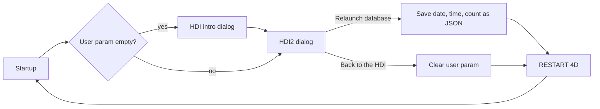

# HDI_RelaunchAndTest

  

A "How Do I" (HDI) example for **4D** showing how to **relaunch a database from its own code and carry state across the restart**, which is the building block for automated database tests.

## Overview

When a database test needs a clean start, you need a way to restart 4D and still know *why* it restarted. This example stores a small JSON object in the database's **user parameter** before calling `RESTART 4D`. On the next startup the database reads it back and shows how many times it has been relaunched, and when.

## Features

- Restart a database from code with `RESTART 4D`.
- Pass information through a restart with `SET DATABASE PARAMETER` / `Get database parameter` (`User param value`).
- First-launch detection: the intro (HDI) dialog appears only when no user parameter is stored.
- Trace mode: the *Trace code* checkbox calls `TRACE` before the restart, so you can step through the relaunch logic.
- Reset: *Back to the HDI* clears the user parameter and restarts to return to the first-launch state.

## How it works



| Item | Where |
|------|-------|
| Entry point (runs from `onStartup`) | `Project/Sources/Methods/00_Start.4dm` |
| Intro dialog | `Project/Sources/Forms/HDI` |
| Relaunch dialog | `Project/Sources/Forms/HDI2` |
| Save state and restart | `Forms/HDI2/ObjectMethods/btnRelaunch.4dm` |
| Reset and restart | `Forms/HDI2/ObjectMethods/btnHDI.4dm` |

## Points of interest

- **Non-blocking dialogs.** Startup uses `CALL WORKER` and `DIALOG(...; *)`, so no extra process or `CLOSE WINDOW` is needed. Re-running *Demo* from the menu brings the existing window to the front instead of opening a duplicate.
- **State lives in `Form`.** The intro dialog hands its `Form` object to the next dialog; there are no interprocess variables.
- **Localised.** All user-facing text comes from XLIFF (`Resources/en.lproj`, `Resources/ja.lproj`).
- **Dark mode and Liquid Glass.** Colours use `automatic` values and `prefers-color-scheme` rules in `styleSheets.css`. Button heights adapt to the macOS theme in `styleSheets_mac.css` (27px for Liquid Glass, 23px for classic).
- **Standard menu actions.** Quit, Edit and Design menu items use 4D standard actions instead of wrapper methods.
- **Method visibility.** Subroutines are marked `invisible` so only real entry points show in *Run method*.
- This project contains no list boxes, so list box display defaults do not apply.

## Requirements

- 4D 21 or later (`compatibilityVersion` 2101)
- macOS or Windows

## Getting started

1. Open `Project/HDI_RelaunchAndTest.4DProject` with 4D.
2. Run the database. The intro dialog appears on the first launch.
3. Click **Demo**, then **Relaunch database**. After the restart, the dialog reports the date, time and relaunch count.

## Project structure

```
Project/Sources/   forms, methods, menus, style sheets
Resources/         images and XLIFF files (en, ja)
```

## Origin

A 4D v18 HDI binary database, converted to a project with 4D 21 and modernised with GitHub Copilot.

## References

- Blog post: <https://blog.4d.com/improving-databases-tests/>
- Original download: <https://download.4d.com/Demos/4D_v17_R3/HDI_RelaunchAndTest.zip>
- [`RESTART 4D`](https://developer.4d.com/docs/commands/restart-4d)
- [`SET DATABASE PARAMETER`](https://developer.4d.com/docs/commands/set-database-parameter)
- [`CALL WORKER`](https://developer.4d.com/docs/commands/call-worker)
- [CSS in 4D](https://developer.4d.com/docs/FormEditor/stylesheets)

## License

See [LICENSE](LICENSE).
